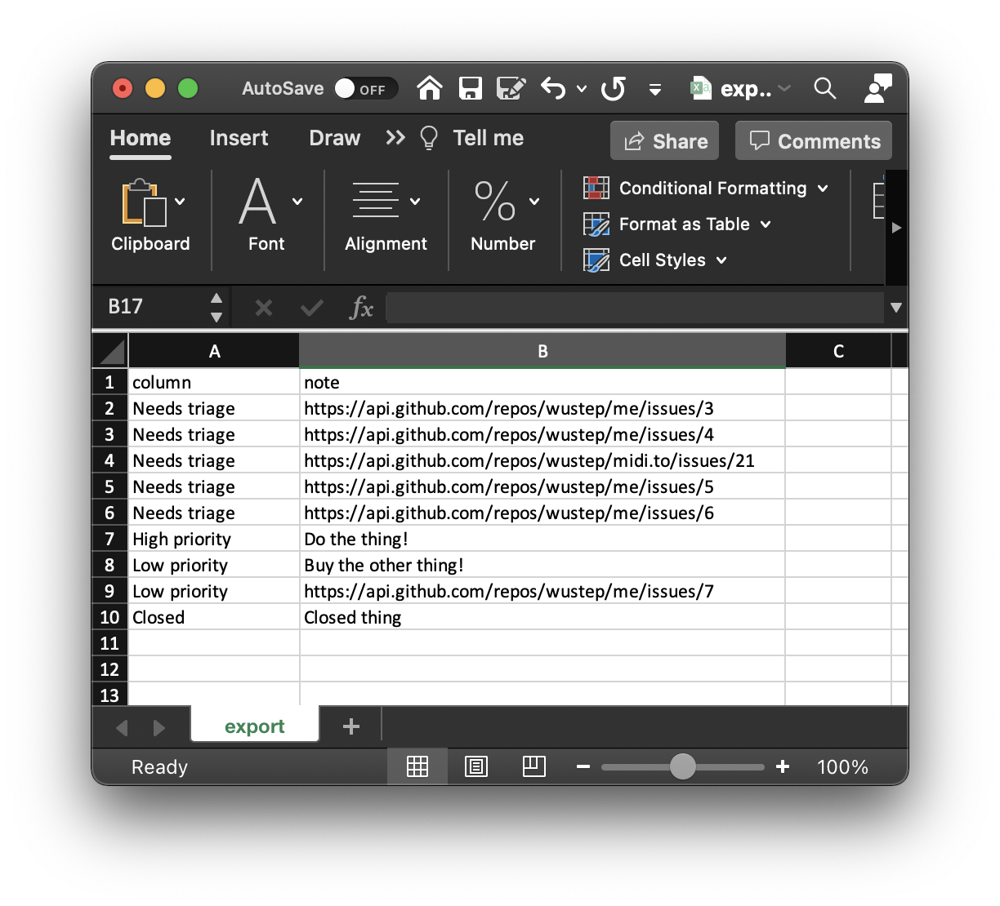

# github-project-exporter
Export GitHub Project cards into CSV files (for Notion and other apps)

I noticed there wasn't an easy way to export GitHub projects to other apps -- so I started building one!

## What this does
Given a GitHub project board:

Terminal output:

CSV output:

## How to use
Make sure you have `yarn` and `node` installed! Use `yarn install` in this directory to install dependencies, then `yarn start` to run the script.

Optionally, look at `env.example` and save a file called `.env` that follows the same structure to set up defaults for the script.

## Contributing
There's a lot more that can be done here, including:
- Fetching more fields, like owner/creator
- Getting the title of Issues and putting them into the column
  - Right now, it just uses the Issue link. My use-case didn't really use Issues, so didn't do this yet.
- More custom parameters

Feel free to submit PRs!
