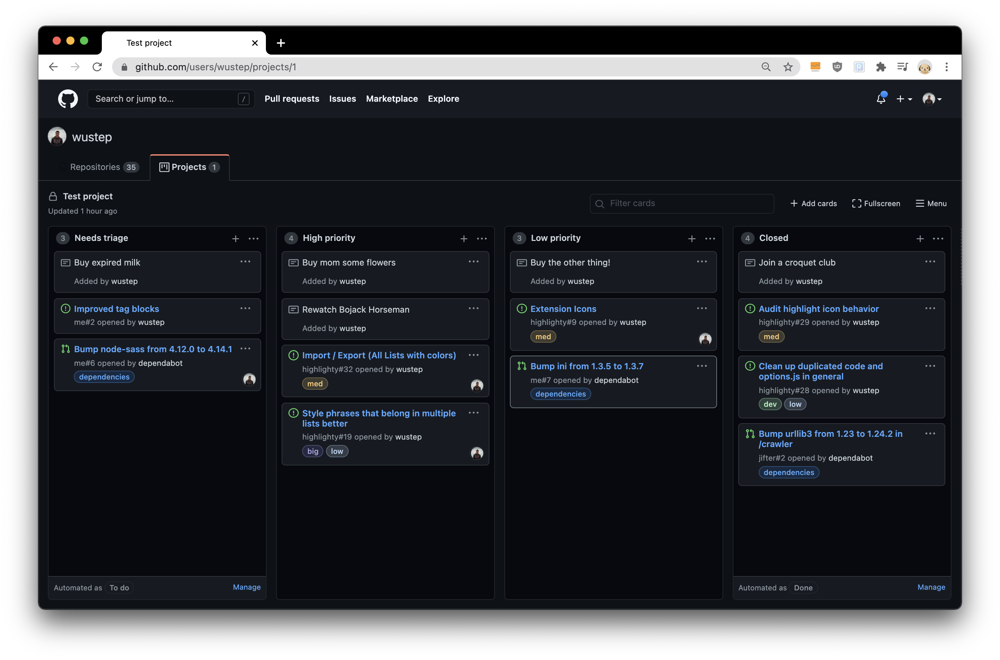
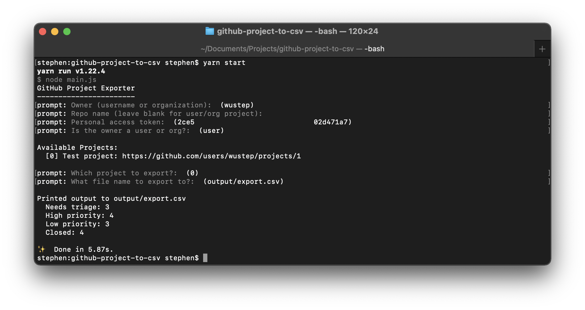
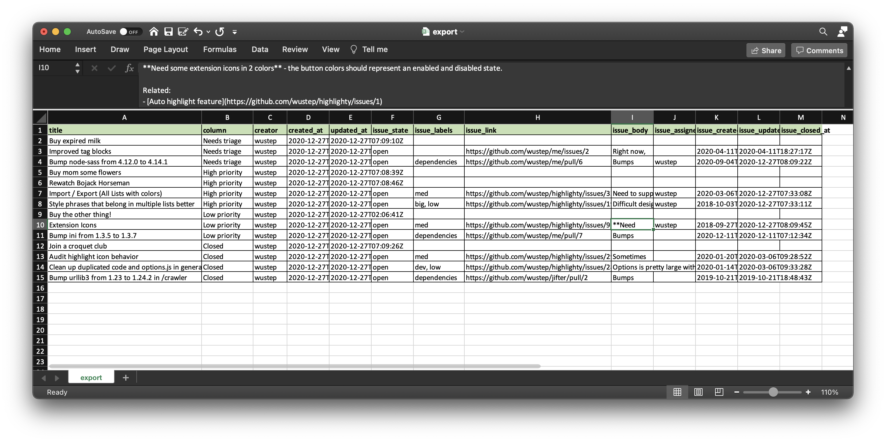
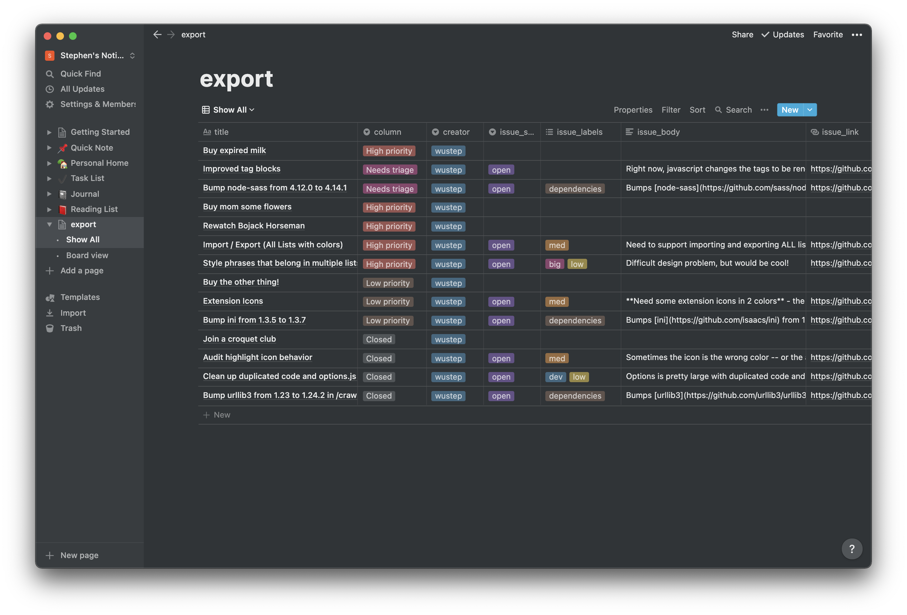
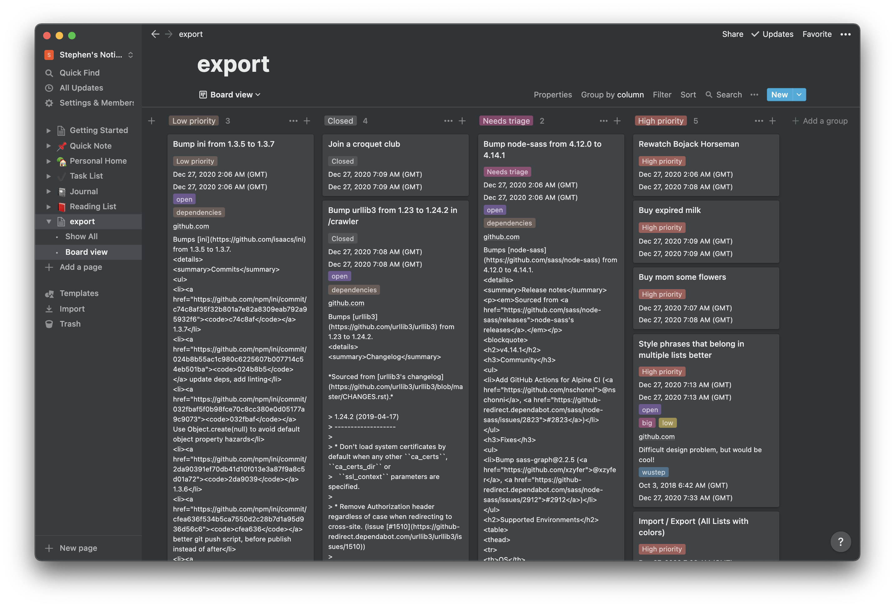

# github-project-exporter

Export GitHub Project cards into CSV files for Notion or other apps!

This project is for the V1 GitHub Project API. [For V2 Project exports, see this project!](https://justinmahar.github.io/github-projectv2-csv-exporter/?path=/story/home--page)

## What this does

Given a GitHub project board:

Terminal output:

CSV output:

Imported to notion:

_Minor processing: I swapped a few columns to be "Multi-Select", added some tag colors, and moved a few columns around._

Notion kanba style (Group by "column"):

_Note that body text from Issues does not convert GitHub HTML to Notion's markdown._

## How to use

Make sure you have `yarn` and `node` installed! Use `yarn install` in this directory to install dependencies, then `yarn start` to run the script.

Optionally, look at `env.example` and save a file called `.env` that follows the same structure to set up defaults for the script.

## Contributing

Feel free to submit a PR or issues and I'll try to respond within a week!

This script uses the [GitHub API](https://docs.github.com/en/free-pro-team@latest/rest/reference/projects) based on API calls from December 2020.

**Todos:**

- `issue_body` text is not imported very cleanly into Notion. (see screenshot above)
  - HTML should ideally be converted to Markdown
  - It should be the body text of the Page instead of a custom field
